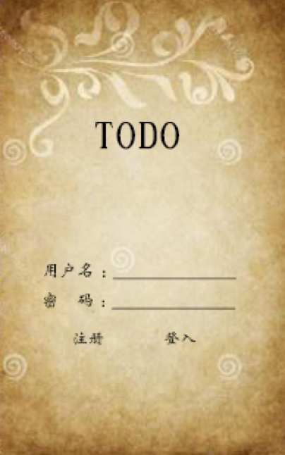
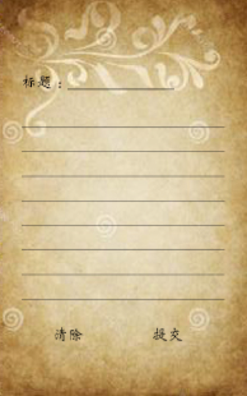

# Web项目建议书

## 项目简介(Introduce)

该项目最终目标是做出一款 *To-Do* 类 App。这类 App 在市面上已经很多了，而且越做越大，也产生了一些该领域的集大成者，而我们的产品则是要走出一条与众不同的路线：**只专注于帮助用户管理To-Do项目，不附带任何额外功能**。*“简洁”*、*“高效”*、*“美观”*是我们这款产品的最大的特色。

在软件功能方面，我们将专注于 *To-Do* 事项：每一个 *To-Do* 事项都是以一个 Tips 的形式展示在用户面前。我们要给用户营造一种使用实体物品的体验，而不是面对的冷冰冰的机器；App 的主界面就如同一块留言板，用户可以在任意空白处单击新建 Tips；界面的右下角则是废纸篓，所有完成的或者不需要的 Tips 都只需拖进废纸篓即可，废纸篓甚至可以周期性自动倾倒。当用户有 *To-Do* 事项时，只需单击空白处，输入 *To-Do* 事项；完成时只需拖入废纸篓，操作及其自然、简单。

## 背景信息(Gathering background information)

*To-Do* 类App是属于效率类 App 的范畴，然而市面上很多产品为了追寻差异化而加入了很多与之无关的功能。久而久之，用户会迷失于这些稀奇古怪的功能当中而忘记自己的初衷——记录 *To-Do* 事项，提高效率。因此，我们要做的这款产品将明确这一需求，并将之付诸于我们的产品中。

因为功能专一，因此我们的 App 界面也将非常的简洁，但这绝不表示界面简单。现在很多App都有复杂的菜单栏，甚至二级、多级菜单，这些多级菜单栏的存在极大的增加了用户的操作成本。而对于一款以效率著称的 App，我们将严格控制菜单的深度，将所有重要功能都展示在用户触手可及的地方，用户不再会因为找某个功能而到处翻菜单。

现如今市面上的主流设计语言都是扁平化设计，虽然这种设计有它的好处，但难免会很抽象。我们要做的这款产品的功能早在电子设备普及前就已经被人类以纸和笔的方式实现，因此，我们这款产品将采用拟物化设计，最大限度的复原用户的这种需求。

## 建议书内容(Components of a proposal)

### APP的主要界面如下：

 

App主界面主要功能：

* 输入用户名，密码点击登录，如果密码不正确，将会出现忘记密码选项，点击，填写注册邮箱即可。

* 点击注册，需要多填写一个注册邮箱，注意查邮件收激活账号。

### 便签界面

 

便签界面主要功能：

* 点击“New Tip“可以创建新的Tip，可以自己定义标题。

* 拖拽某项Tip到下方dustbin图标即可删除。

* 空白处右键菜单，可以改变颜色，语言，设置自动提交时间间隔（例如每隔5分钟自动提交一次）。

### 新建便签

 

新建界面主要功能：

* 界面简洁，齐全。 

* 清除所有内容。

* 点击提交将更新服务器端个人仓库。

### 废纸篓界面

 

*不能修改垃圾桶中的Tip内容*，修改删除的Tip被认为是没有意义的。所以用户只能先恢复Tip，再修改Tip内容。

每隔一段时间，垃圾桶中的Tip将全部被清空。这个时间段可以由用户设置。

废纸篓界面主要功能：

* 拖拽Tip到恢复选项，即可实现Tip的恢复，操作简单。

* 如果确定删除Tip,可以手动拖拽到彻底删除，实现立即删除！

* 如果想要恢复某个Tip，拖拽到“复活图标”即可。

* 确定立即删除，请拖到这里。

* 空白处右键，可以设置自动删除的时间段。

* 垃圾桶中Tip按照删除时间先后排序。

以上是这个App的大致功能和主要界面。可以看到，界面很简洁，但是可以满足用户的主要需求。

## 内容提要(The executive summary)

本文以市场上 *To-Do* 类产品的过于复杂为问题的研究起点，通过对市场的调研，确定该类产品过于复杂的问题。对问题进行分析将产品定位于简洁的 *To-Do* 应用，明确要解决的问题，目标市场，对所做产品在To-Do类产品中成功机会的估算以及竞品分析和营销手段。

（第三部分建议书内容类似于MRD）评估出产品的可行性较高，进一步探索用户需求，将用户需求转化为产品需求，明确需求场景，具体内容，重要性。根据需求，设计出项目的原型，产生项目的流程图和总体要求。最后明确项目预算，组织信息和意见等。

## 需求状态(The statement of need)

在日常生活中，我们总是有许许多多的事情需要着手去做，等着我们去安排，在这繁杂的过程中，有时会有一些重要的事情就这样被我们遗忘，等到想起来才追悔莫及。所以一个必要的 *To-Do* 类 Web App 在日常生活中是许多人的首要选择。

目前市场上提供 *To-Do* 的功能的 web 应用有许多，但是为了追求功能的多样性以及独特性，大多加入了许多花哨的，并不太实用的各种功能，使得操作复杂化。而经过调研，大部分的用户使用的初衷并不需要那些格外附加的各种功能，这些增添的功能反而使得用户花了更多的时间在研究他们上，而耽误了其核心目的，增加了操作的复杂性。根据多方面的用户调查，信息搜集，一个*简洁，美观，实用* 的 *To-Do* 类 Web App 是许多用户的需求，在目前的市场上，我们的这款应用还是有很大的需求空间的。

## 项目描述(The project description)

该项目的功能是为了更好的贴合人们应用的实际，让人们能在繁忙的生活中养成记事的好习惯，不至于丢三落四，在如此快节奏的生活中掌握好自己的火候。并且简洁的界面也可以让用户更好的简便的使用这款 App。

该项目主要分为三个层面，最上层的用户操作界面，用于显示简洁的界面，为用户提供很好的交互功能；中间的是业务逻辑层，用于用户输入和数据库传出中的数据处理，将用户界面模块和数据库模块很好的连结在一起，并能准确的提取和传入数据；底层的数据库用于存取用户的数据，用户传入的数据在数据库中存储被进行备份，能够让数据尽可能地永久保存。

## 预算(The budget)

预算由三部分组成：

* 前期调研：100元

* 项目开发：500元

* 后期运维改进：500元

**总计：1100元**

## 组织信息(Organizational information)

我们组织共由十名成员：

* 13130110024  高海硕  ***(leader)***

* 13130110009  林    增 *** (assistant)***

* 13130110008  王谞上

* 13130110010  周    桦

* 13130110025  郭泰成

* 13130110002  黄超敏

* 13150210006  彭    琦

* 13130110031  袁    点

* 13130110019  古国亮

* 13130110006  林增跃

## 意见书(Letter proposal)

每当遇到身边的事情比较多，比较乱，怕忘记去做，就会开始想使用 *To-Do* 类应用。现在存在的 *To-Do* 类 App 太多了，在使用的过程中，看到 OmniFocus 可能会想 Things 的简单漂亮，用 Things 的时候会想 Omni Focus 的强大，而且现在的 Omni Focus 2 的设计也相当不错了，很简约漂亮。

工具有的时候不是那么重要，我们需要的是能让工作顺利完成的就行了。那些精美的工具并不能帮我们完成工作，买了 Kindle 并不能让我们读更多书。

要想在诸多 *To-Do* 类应用中脱颖而出，必须有我们更加特殊而又人性化的改变，在简便易用的同时要增加一些个性化设置。这款 App 可以站在已有 App 的基础上，借鉴一些好的设计思路和设置，抛弃繁杂的方面，最重要的是一点——可供用户免费使用。

用过 Things 的都知道这是一款又小又美的 App，但是没有网页版和 Windows 平台，同步起来还需要翻墙，对一些办公室白领类的使用者来说，不是很方便，这是我们需要借鉴的地方。还有像小米手机的 NOTE 笔记中的一些个性化设置一样，我觉得它的界面设计比较简便，提供本地搜索 note 和自动保存的功能，另外每个 note 中还可以记录创建时间和设置闹铃用来提醒用户及时完成工作。这些都是可以在已有的功能上增加的一些人性化设置。

## 总结(Conclusion)

随着互联网时代的到来，时间管理和事务管理已经成为了每个人生活中不可缺少的一部分。为满足现代快节奏、高效率生活的需要，各种 *To-Do* 类 App 随之兴起。

而我们所要设计的  *To-Do* 类App无论是从简洁性和美观性等方面，还是从实用性和易用性方面都能够极大程度上满足用户的需求。不追求应用功能的多样性，而是专注于事务管理，给用户本质上的应用体验而不至于本末倒置去追求一些花哨多余的功能。

凭借项目小组目前所掌握的 Web 开发技术以及现有的资源，足以开发出满足以上功能以及满足用户需求的 *To-Do* 类 Web App。

