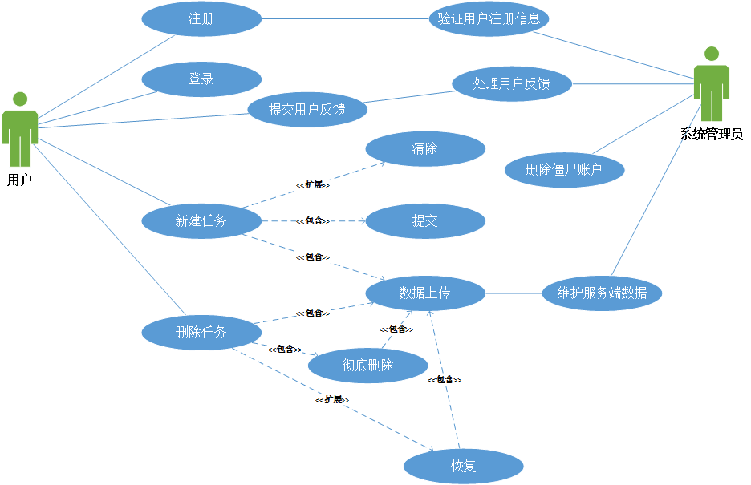
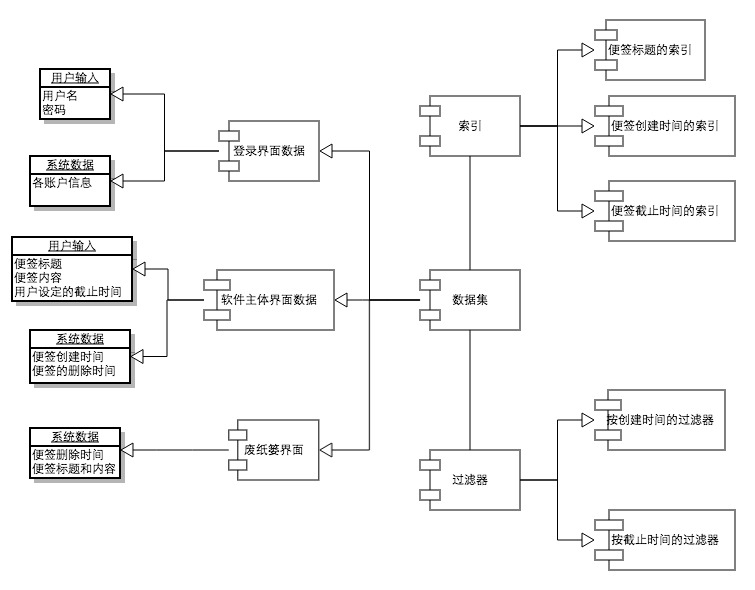
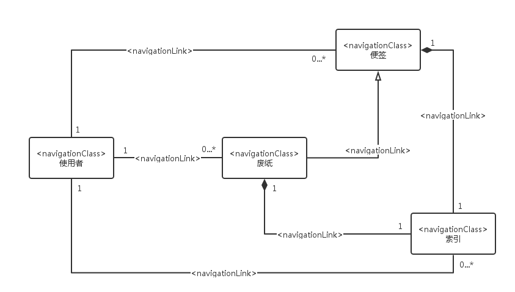

# Web 应用建模图

## 需求建模

需求模型：
To-Do类服务系统

| 用例名称    | 用例描述                                     |参与者|
|------------|:-----------------------------------------:|-------|
| 注册        | 该用例描述一个游客初次进入该系统需要创建一个账户| 用户 |
| 登录        |该用例描述已经创建账户的用户使用系统时需要登录   | 用户 |
| 新建任务    | 该用例描述用户建立一个任务                     | 用户 |
| 删除任务    |该用例描述用户删除一个任务                      |用户|
| 提交用户反馈 |该用例描述用户对使用该应用进行反馈使用情况       |用户|
| 清除        |该用例描述用户在提交任务之前对任务修改时进行清除的操作|用户|
| 提交       |该用例描述用户确认任务新建完毕而进行提交           |用户|
|数据上传    |该用例描述用户对任务的操作之后的数据上传至远端数据库 |用户|
|彻底删除|该用例描述用户对任务删除操作提交到数据库而不能恢复       |用户|
|恢复       |该用例描述用户恢复删除的任务                        |用户|
|验证用户注册信息|该用例描述管理员对用户注册信息的验证       |系统管理员|
|处理用户反馈|该用例描述系统管理员对用户反馈信息的收集处理   |系统管理员|
|删除僵尸账户|该用例描述系统管理员对长期不使用的账户进行清除操作|系统管理员|
|维护服务端数据|该用例描述系统管理员对服务端数据的维护处理操作|系统管理员|

## 内容建模

## 超文本建模

组成模型：

## 适应性建模

## 展示建模
