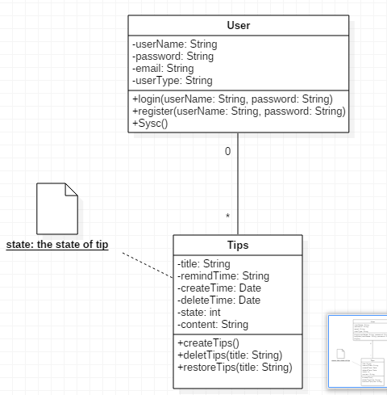
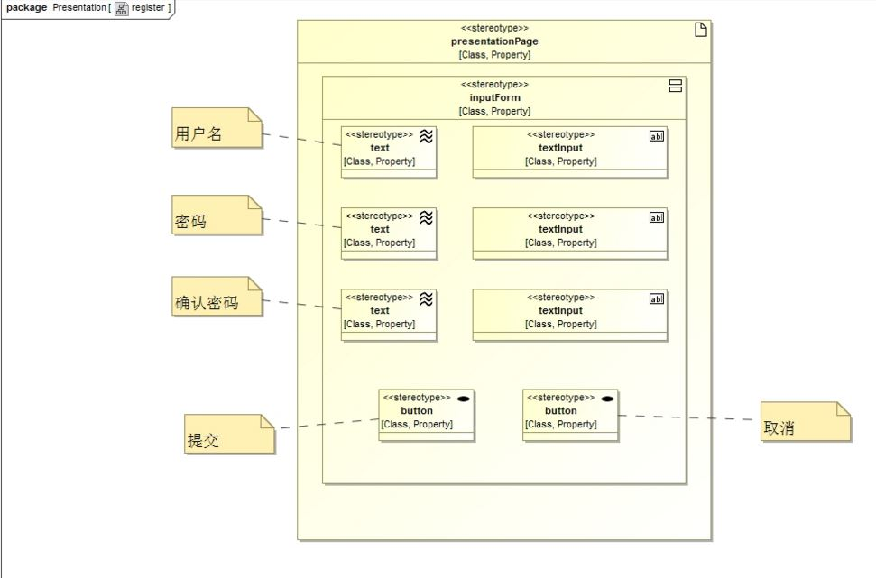
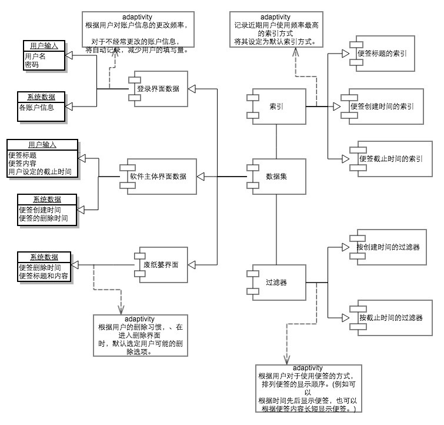
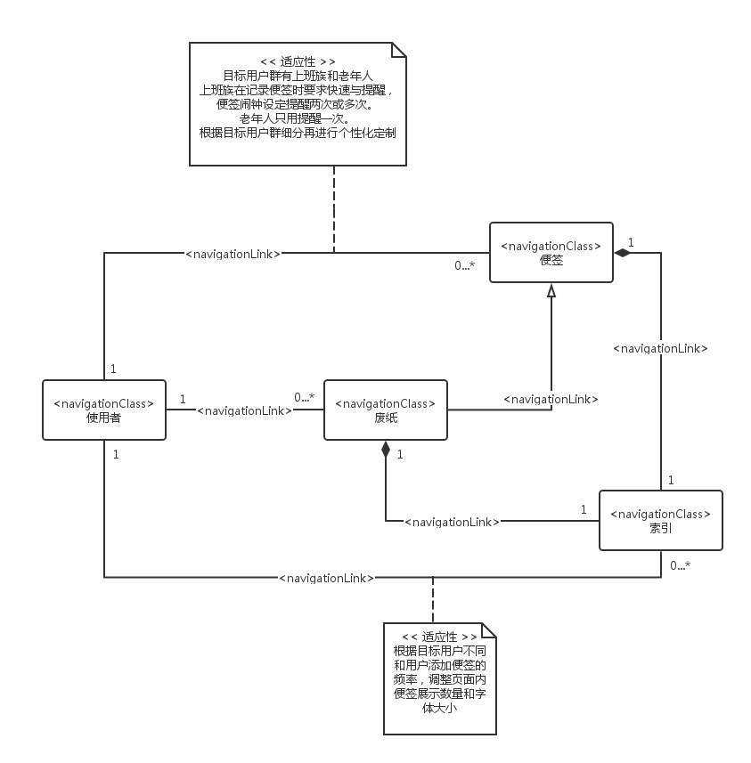
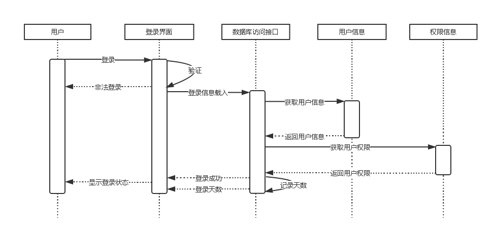

# Web 应用建模图

## 需求建模

需求模型：
To-Do类服务系统

| 用例名称     |            用例描述             | 参与者   |
| -------- | :-------------------------: | ----- |
| 注册       |  该用例描述一个游客初次进入该系统需要创建一个账户   | 用户    |
| 登录       |   该用例描述已经创建账户的用户使用系统时需要登录   | 用户    |
| 新建任务     |        该用例描述用户建立一个任务        | 用户    |
| 删除任务     |        该用例描述用户删除一个任务        | 用户    |
| 提交用户反馈   |    该用例描述用户对使用该应用进行反馈使用情况    | 用户    |
| 清除       | 该用例描述用户在提交任务之前对任务修改时进行清除的操作 | 用户    |
| 提交       |    该用例描述用户确认任务新建完毕而进行提交     | 用户    |
| 数据上传     | 该用例描述用户对任务的操作之后的数据上传至远端数据库  | 用户    |
| 彻底删除     |  该用例描述用户对任务删除操作提交到数据库而不能恢复  | 用户    |
| 恢复       |       该用例描述用户恢复删除的任务        | 用户    |
| 验证用户注册信息 |     该用例描述管理员对用户注册信息的验证      | 系统管理员 |
| 处理用户反馈   |   该用例描述系统管理员对用户反馈信息的收集处理    | 系统管理员 |
| 删除僵尸账户   |  该用例描述系统管理员对长期不使用的账户进行清除操作  | 系统管理员 |
| 维护服务端数据  |   该用例描述系统管理员对服务端数据的维护处理操作   | 系统管理员 |

## 内容建模
### 静态建模-类图：

 

## 超文本建模

组成模型：

## 适应性建模

##   

## 展示建模

Web工程展示建模和传统软件工程一样，Web应用的展示建模主要针对Web应用的用户界面，其不同点在于Web应用的主要表现形式是Web页面。Web页面是Web应用的基础，用户所看到的信息以Web页面通过浏览器展现出来。因此Web应用的展示建模主要是对Web页面进行建模。 展示建模包括两个方面：一是通过建模页面中的通用元素产生一致的展示概念，并且展示每个页面的组成以及其中包含的字段、文本、图片、表单等内容；二是描述用户界面的交互特性，例如单击某个按钮可以激活应用逻辑的某个功能，同时要考虑提供给用户必要的导航路径、用户访问历史等信息以防止用户迷失在复杂的应用之中。

静态建模 建模元素可以分为三个层次：表示页面，表示单元，表示元素 我的静态建模分为三个页面

 1. register页面： 用于用户进行注册，功能如下：用户访问register页面，填写用户名、密码并点击注册按钮进行注册操作。(static_register.JPG)
 2. login页面： 用于用户进行登录，功能如下：用户访问login页面，填写用户名、密码并点击登录按钮访问personalPage页面。(static_login.JPG)
 3. Todo主页面：用于用户进行任务的添加删除等操作。（图片补上）

 