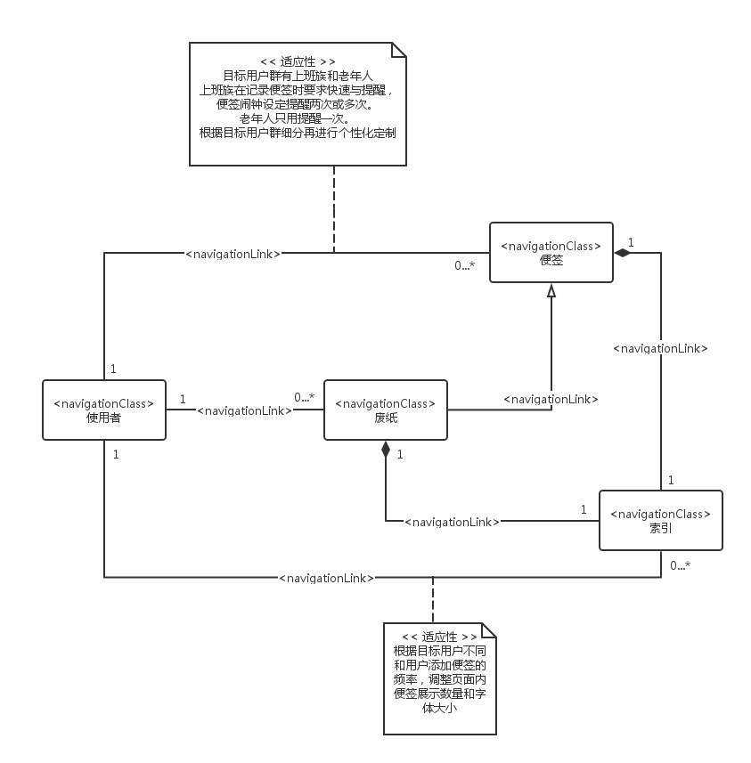

# Web 应用设计

## Web 应用设计特性

## 交互设计
### 表单控制
表单设计方面，我们最主要的应用体现在在用户新建一个ToDo项目时候进行信息的搜集，采纳，以完成对项目的构建。本着简单实用的原则，我们大体构建四个表单标签：**主题；提醒时间；重复；内容**。采用左对齐，每一个标签后的的输入框架内实用半透明子来进行输入提醒，点击后自动消除。样例：

点击**完成添加**之后就可以保存为新的ToDo事件
### 窗体控制
各个元素与与导航结构方面具体可参看导航建模进行构建

### 输入设计
不同输入框有隐含的限制多少字数的属性，当发现用户输入字数超过限制，在输入框右侧采用红色字体进行提醒。提醒的内容为：超出**字数。
而一个输入框能容纳的字数需要根据输入信息进行设置，如创建事件中的具体内容表单项，设置能容纳4行文字，当超过限制时出现滚动条进行拉伸。
### 提示信息
当鼠标停留在某个组件上超过1.5秒，或者触摸设备上长按1秒，界面上将以半透明浅深色白框进行提示当前所在组件的作用，或者点击组件将实现的功能。提示出现4秒之后变淡消失，在改变当前停留组件之前不再出现。
在登录界面中，用户名与密码框输入部分在未输入使采用浅色字体进行提示需要输入的内容，在被点击时自动消除。当密码或者账户出现错误时采用红色字体在右边提示。样例：

### 出错处理及出错页面的跳转
当出现错误时，应用将当前的个人信息，事件进行保存并上传至服务器进行备份，弹出需要进行错误处理的提示信息，除报告程序出现的异常以外，并询问是否将本次错误报告上报给服务商，并给出两个选项。

**1.确定** 将本次发生的错误信息上传给服务器以今后进行更新处理，然后应用跳转至之前未发生错误页面，或者关闭应用。
**2.取消** 应用不对错误进行任何处理，直接跳转至之前未发生错误页面，或者关闭应用。

## 展示设计

## 内容设计

## 功能设计

